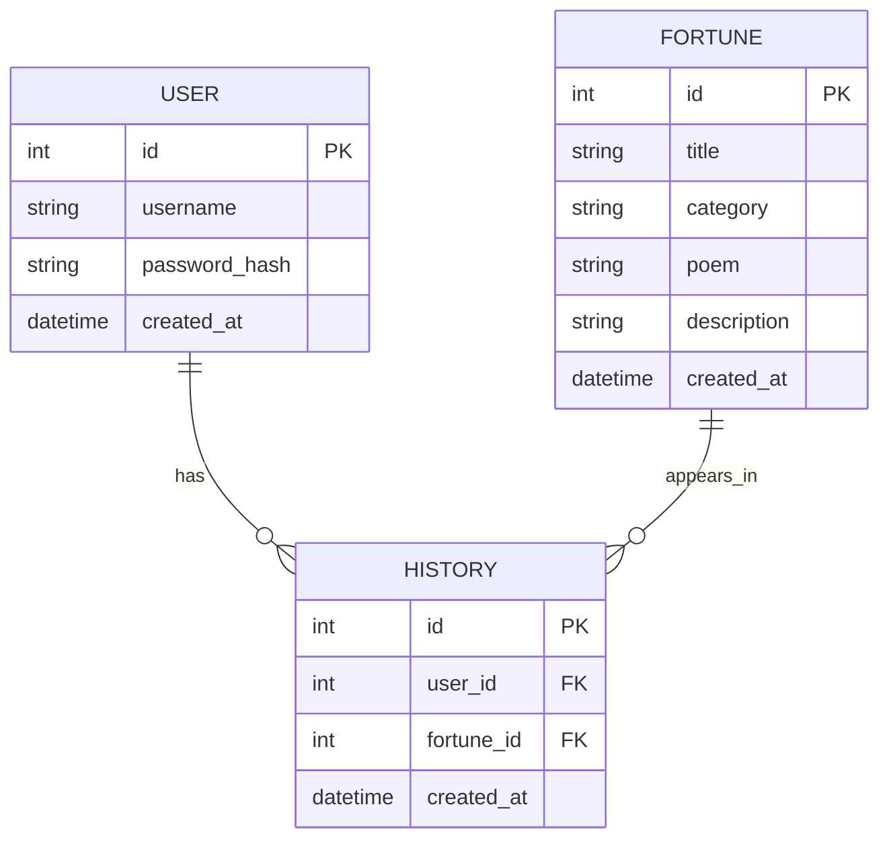

# DB Design — 資料庫設計

## 1. ER 圖（實體關係圖）

## 2. 資料表詳細說明

### `USER` (會員資料表)
用途：儲存使用者的註冊帳號與密碼等資訊。
- `id`: (INTEGER) Primary Key，自動遞增。
- `username`: (TEXT) 使用者名稱或帳號，必須唯一且必填。
- `password_hash`: (TEXT) 雜湊加密過後的密碼，必填。
- `created_at`: (DATETIME) 帳號建立時間，預設為當前時間。

### `FORTUNE` (籤詩題庫表)
用途：儲存系統內建的所有籤詩或占卜結果。
- `id`: (INTEGER) Primary Key，自動遞增。
- `title`: (TEXT) 籤詩標題，例如「第三十二籤」，必填。
- `category`: (TEXT) 籤詩吉凶，例如「大吉」、「下下籤」。
- `poem`: (TEXT) 籤詩原文內容，必填。
- `description`: (TEXT) 籤詩詳細白話文解析，必填。
- `created_at`: (DATETIME) 建立時間，預設為當前時間。

### `HISTORY` (算命紀錄表)
用途：儲存使用者每一次抽籤的歷史紀錄。
- `id`: (INTEGER) Primary Key，自動遞增。
- `user_id`: (INTEGER) Foreign Key，關聯至 `USER.id`，必填。
- `fortune_id`: (INTEGER) Foreign Key，關聯至 `FORTUNE.id`，必填。
- `created_at`: (DATETIME) 算命抽籤時間（預設為當前時間）。

## 3. SQL 建表語法

位於 `database/schema.sql` 檔案中。包含基本的 `users`, `fortunes`, `histories` 資料表建立與外鍵設定。

## 4. Python Model 程式碼

位於 `app/models/` 目錄中，使用 Python 內建的 `sqlite3` 提供基本的 CRUD 封裝。
- `user.py`
- `fortune.py`
- `history.py`
