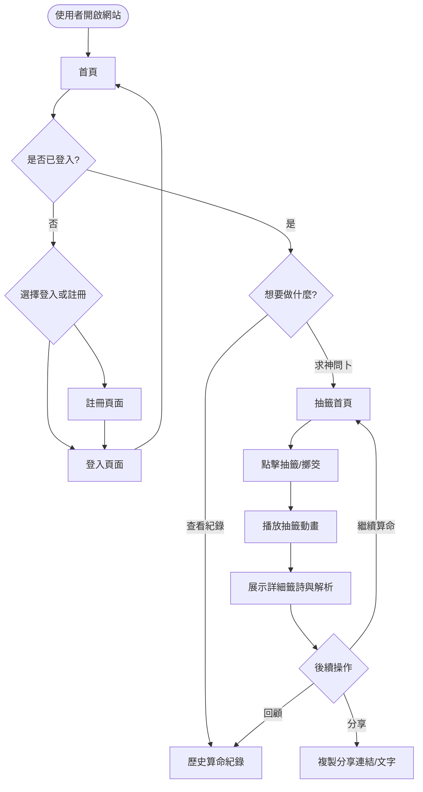
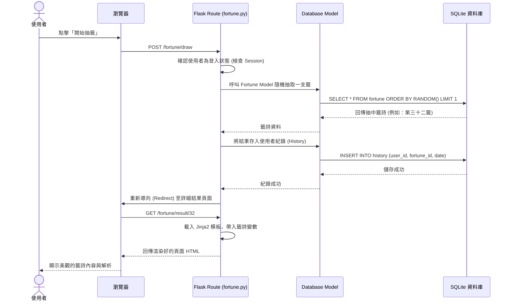

# 流程圖：線上算命系統

## 1. 使用者流程圖（User Flow）

這張圖描述了使用者進入網站後的主要操作路徑與體驗流程。

## 2. 系統序列圖（Sequence Diagram）

以下是一次完整的**線上抽籤**運作機制。描述從使用者點擊抽籤按鈕，到系統返回最終結果畫面的整個資料流動。

## 3. 功能清單對照表

整理目前架構與流程對應的 HTTP 路由表，此表可直接作為後續「API 與路由設計」的藍圖參考。

| 功能模組 | 功能名稱 | URL 路徑 | HTTP 方法 | 備註說明 |
| :--- | :--- | :--- | :--- | :--- |
| **首頁** | 網站首頁入口 | `/` | GET | 展示網站形象與功能入口 |
| **會員(auth)** | 註冊帳號 | `/auth/register` | GET, POST | 呈現表單(GET)，與送出寫入資料表(POST) |
| **會員(auth)** | 登入 | `/auth/login` | GET, POST | 驗證帳密並發放 Session |
| **會員(auth)** | 登出 | `/auth/logout` | GET | 清除使用者的登入 Session |
| **算命(fortune)** | 抽籤入口 | `/fortune/` | GET | 準備準備抽籤的頁面（例如點擊靈籤筒） |
| **算命(fortune)** | 執行抽籤 | `/fortune/draw` | POST | 系統隨機挑選籤詩並儲存抽籤紀錄 |
| **算命(fortune)** | 結果展示 | `/fortune/result/<id>` | GET | 渲染 Jinja2 模板呈現抽中的詳細解說 |
| **與歷史(history)**| 個人紀錄 | `/history/` | GET | 從歷史資料表撈出過往曾擁有的算命與抽籤清單 |
